# API Request/Response Flow Diagrams

This document illustrates the request/response flows for all major operations in the Manufacturing Service API.

## 1. Authentication Flow

### User Registration
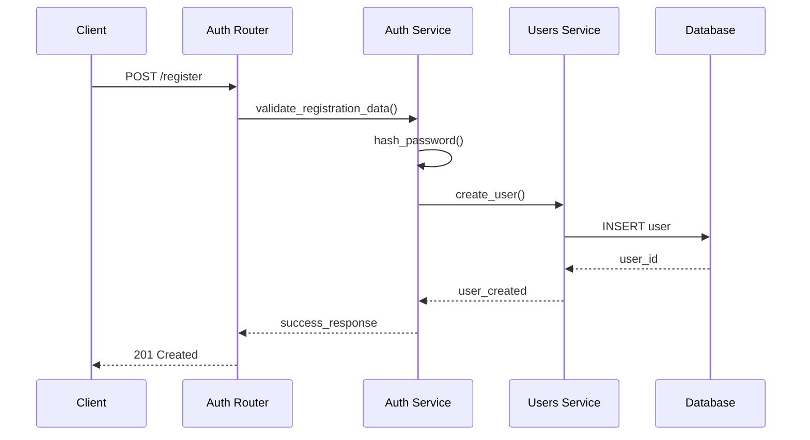

### User Login
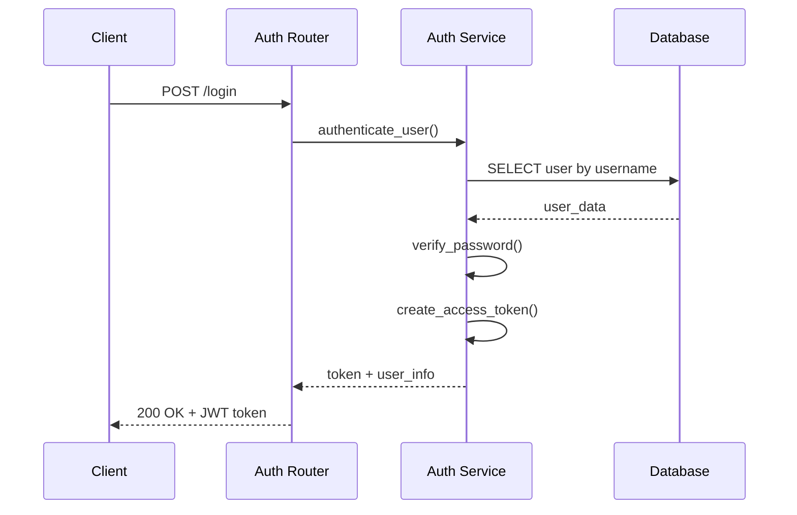

## 2. File Upload Flow

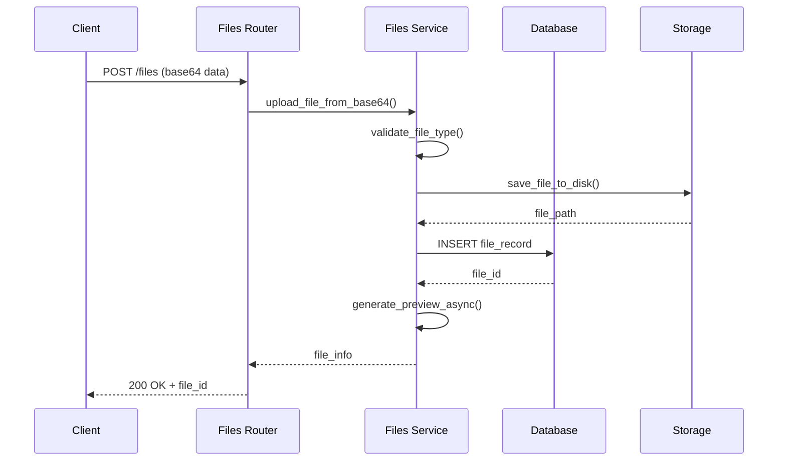

## 3. Calculation Flow (ML-Based)

### With File ID (File-Based Calculation)
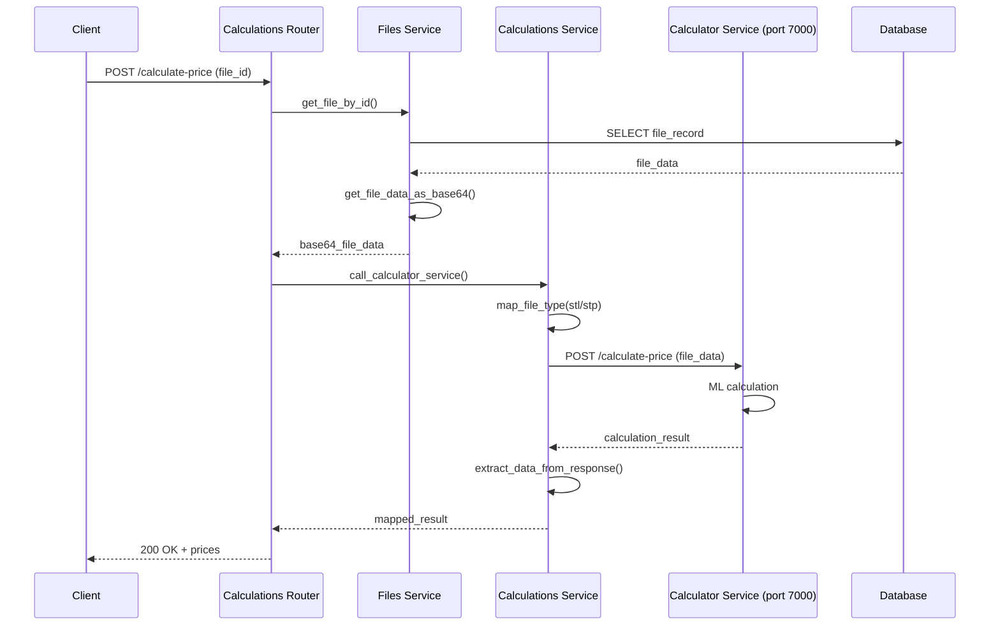

### With Dimensions Only
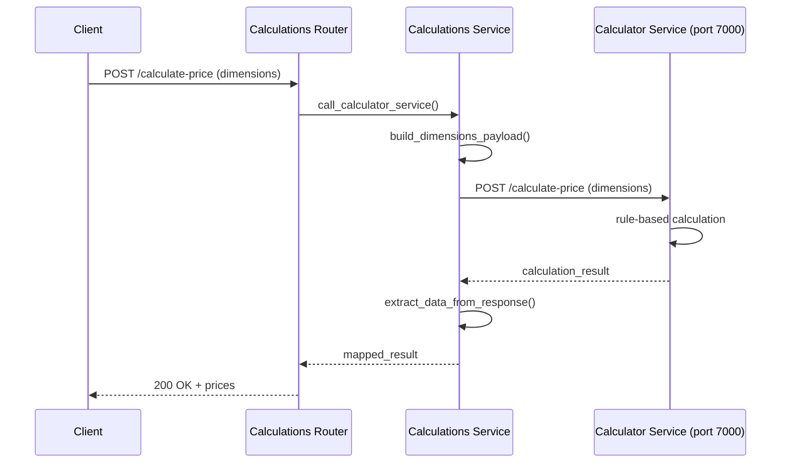

## 4. Order Creation Flow

### With File (File-Based Order)
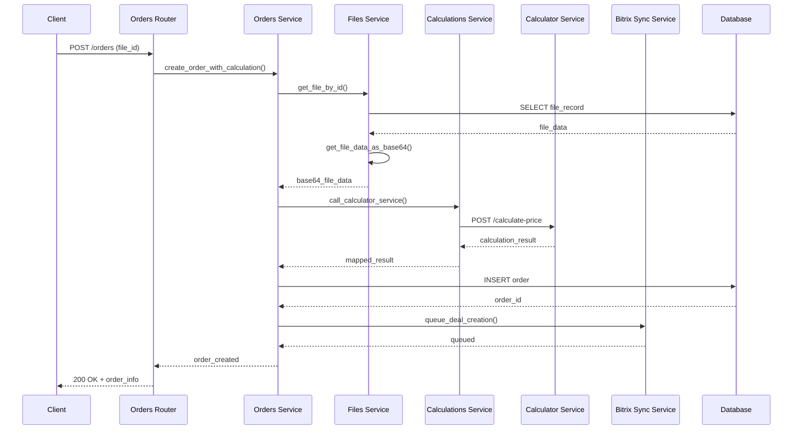

### With Dimensions Only
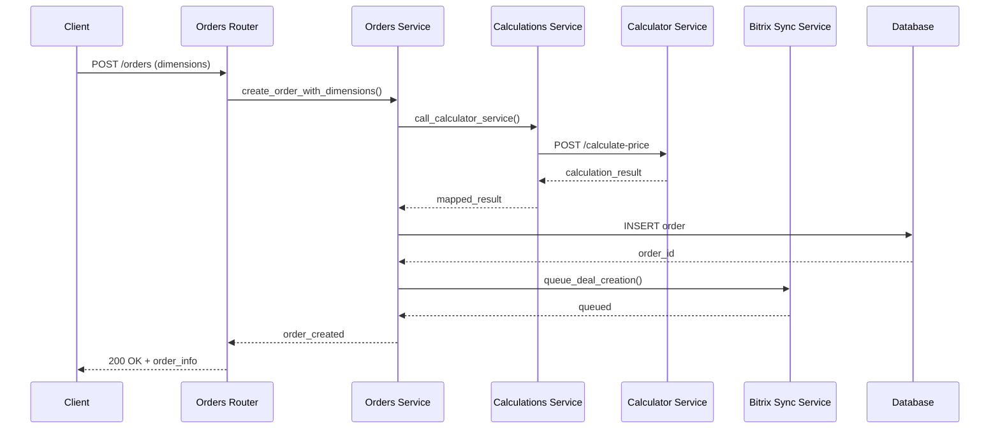

## 5. Order Management Flow

### Order Update
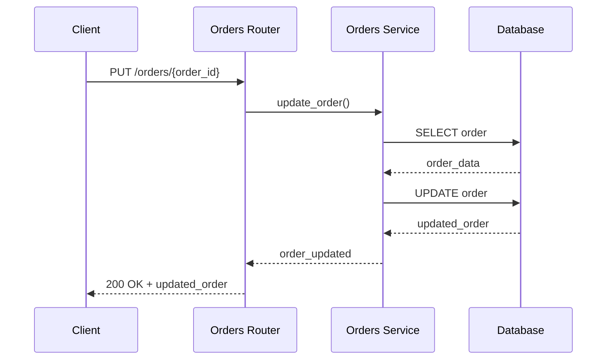

### Order Recalculation
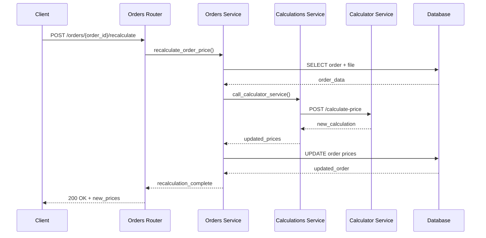

## 6. Bitrix Integration Flow

### Contact Synchronization
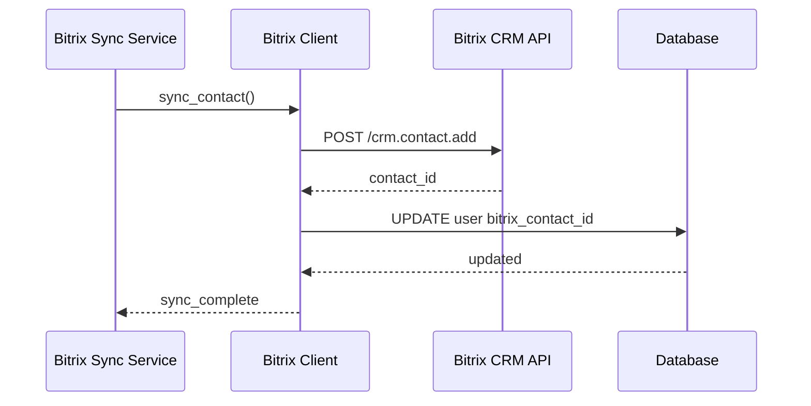

### Deal Creation from Order
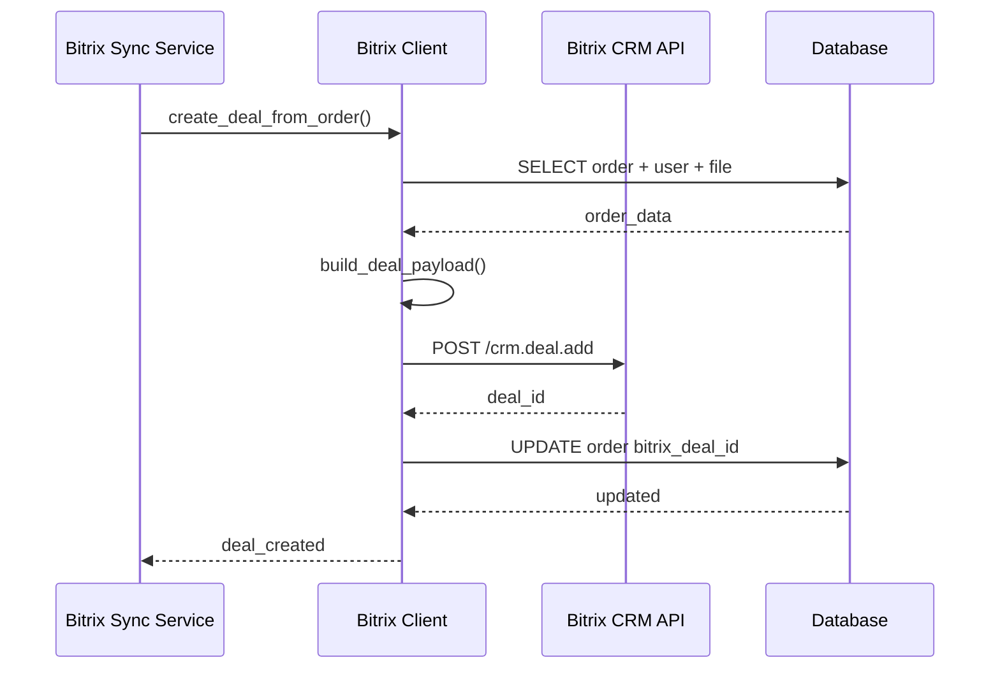

### Webhook Handling
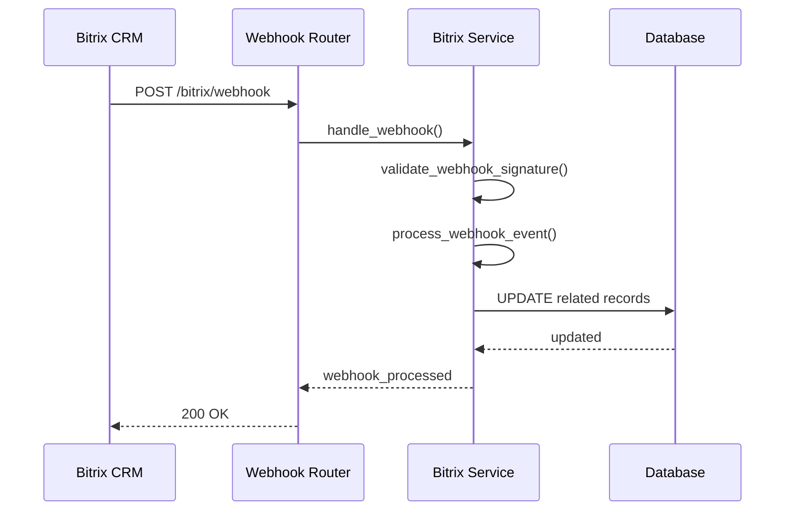

## 7. Document Management Flow

### Document Upload
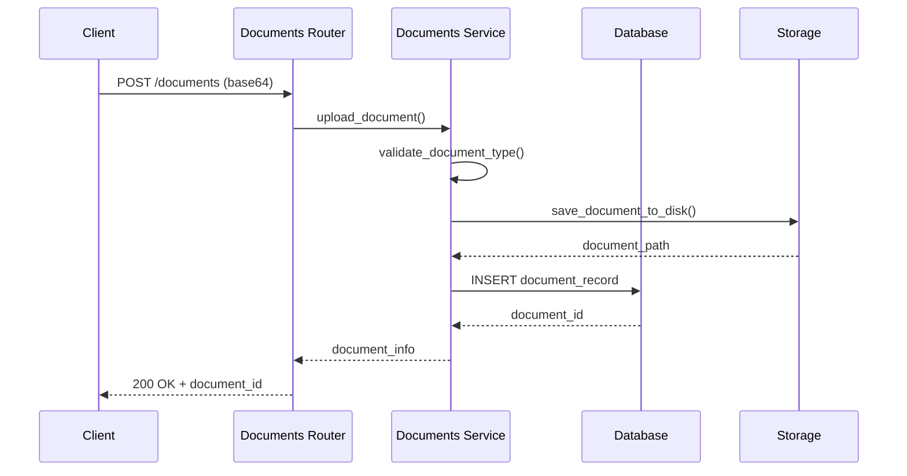

### Document Attachment to Order
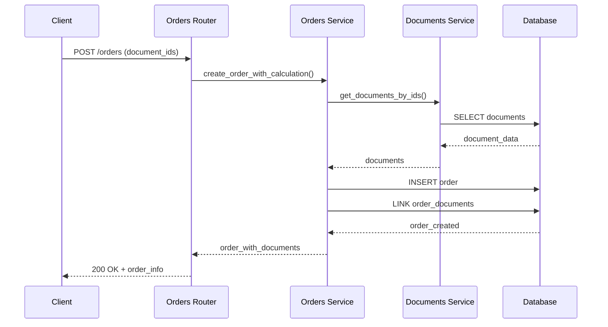

## Key External API Calls

### Calculator Service (localhost:7000)
- **Purpose:** ML-based manufacturing price calculations
- **Key Endpoint:** `POST /calculate-price`
- **Input:** File data (base64) or dimensions + material parameters
- **Output:** Detailed pricing with ML prediction hours and complexity metrics

### Bitrix CRM API
- **Purpose:** Customer and deal management
- **Key Endpoints:** 
  - `POST /crm.contact.add` - Create contacts
  - `POST /crm.deal.add` - Create deals
  - `GET /crm.deal.list` - List deals
- **Authentication:** API key-based
- **Rate Limiting:** Handled by Bitrix client

