# Architecture Diagrams - Function Call Flows

This document shows the detailed function call flows for all API endpoints, illustrating the layered architecture and dependencies.

## Layered Architecture Overview

The API follows a three-layer architecture pattern:

```
┌─────────────────┐
│   Router Layer  │ ← HTTP endpoints, request validation, response formatting
├─────────────────┤
│  Service Layer  │ ← Business logic, external API calls, data processing
├─────────────────┤
│Repository Layer │ ← Database operations, data access
└─────────────────┘
```

**Key Dependencies:**
- Router → Service (business logic)
- Service → Repository (data access)
- Service → External APIs (calculator service, Bitrix)
- All layers → Core utilities (logging, config, models)

## 1. Authentication Endpoints

### POST /register
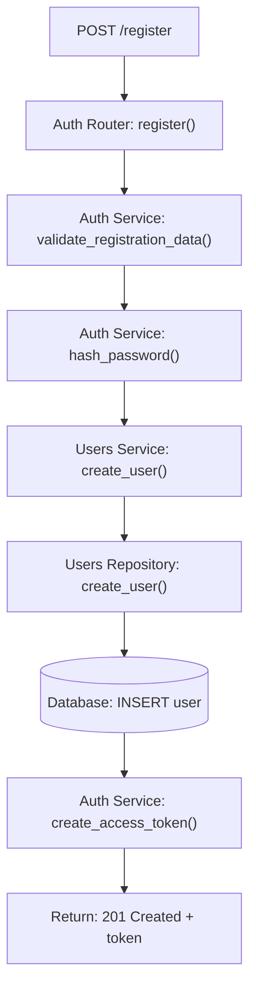

### POST /login
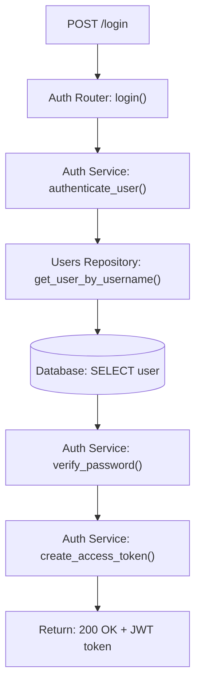

### POST /logout
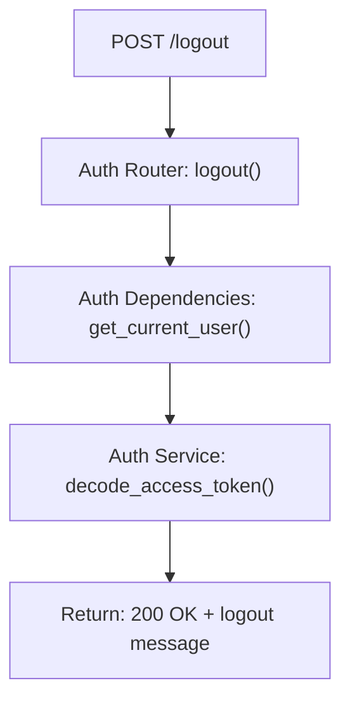

## 2. User Endpoints

### GET /profile
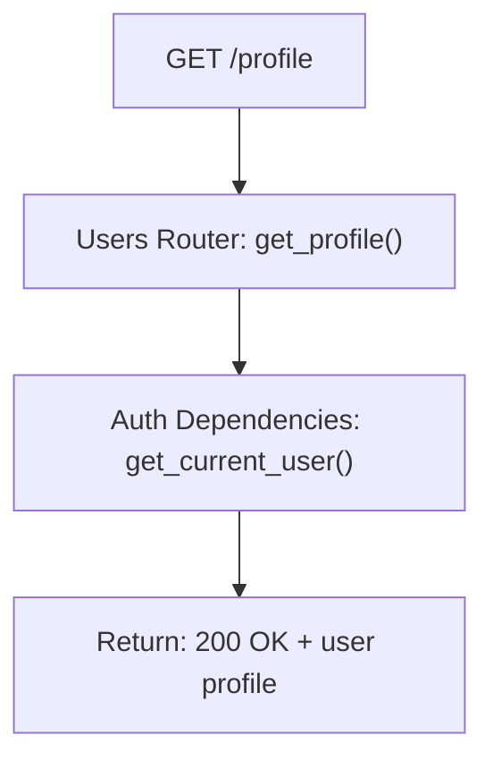

### PUT /profile
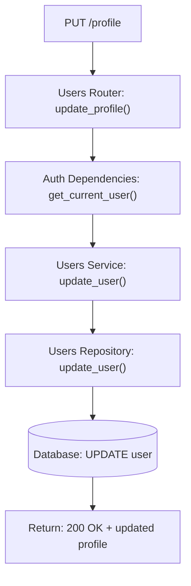

### GET /users (Admin)
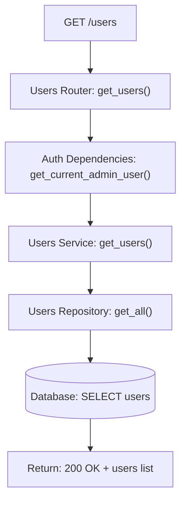

## 3. File Endpoints

### POST /files
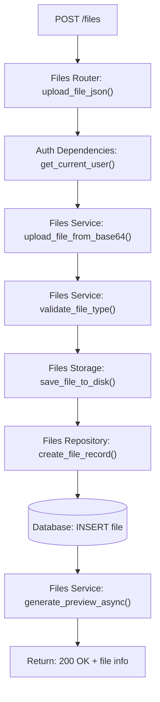

### GET /files
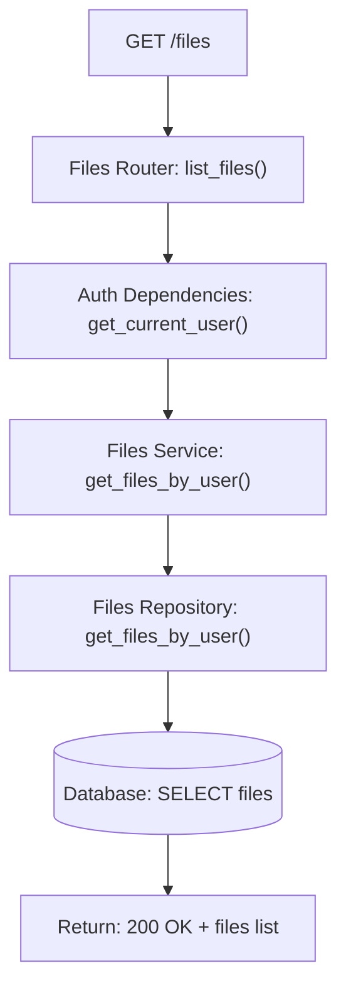

### GET /files/{file_id}
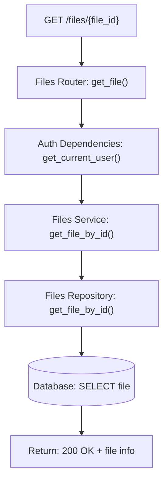

### GET /files/{file_id}/download
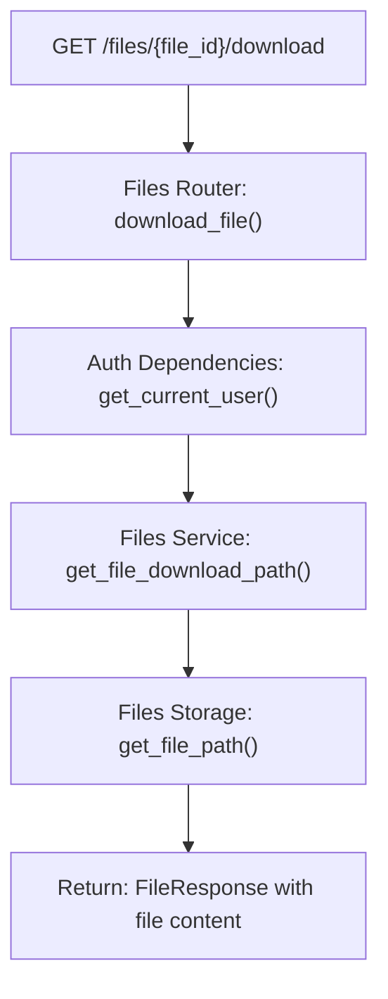

## 4. Document Endpoints

### POST /documents
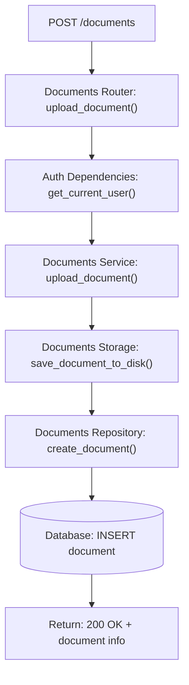

### GET /documents
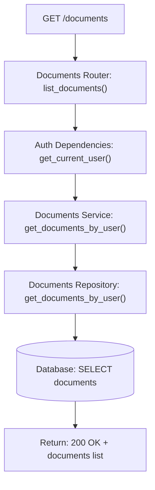

## 5. Calculation Endpoints

### POST /calculate-price (Main Endpoint)
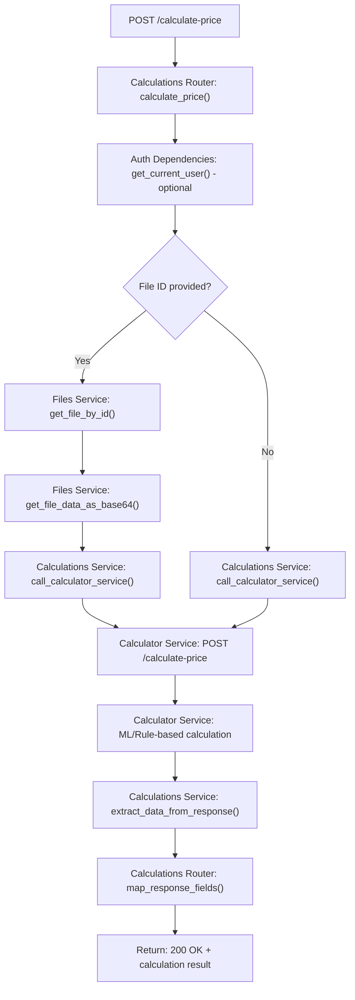

### GET /services
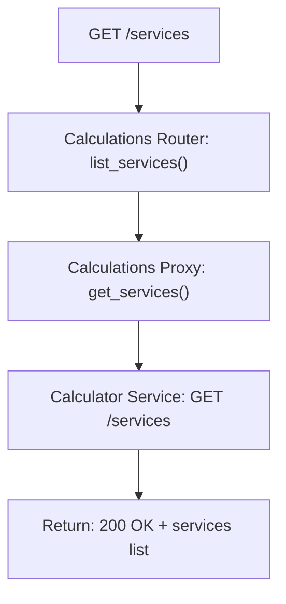

### GET /materials
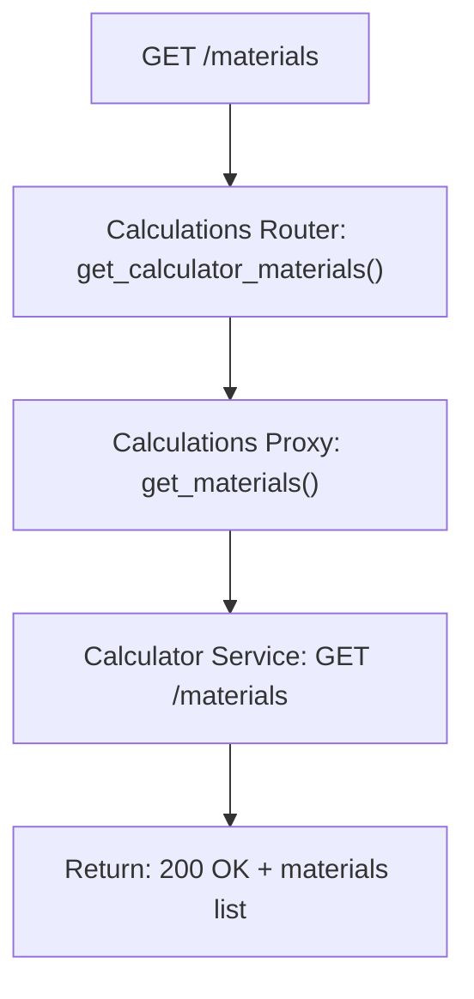

## 6. Order Endpoints

### POST /orders
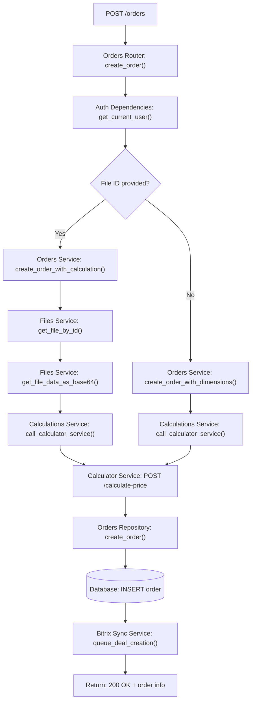

### GET /orders
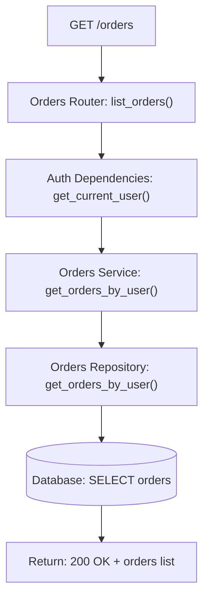

### PUT /orders/{order_id}
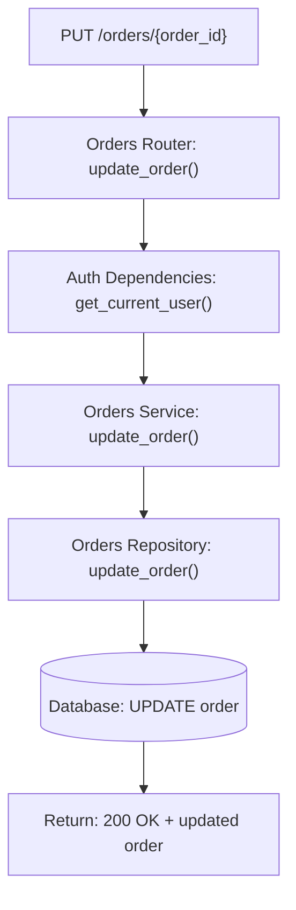

### POST /orders/{order_id}/recalculate
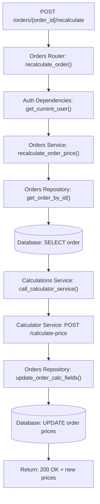

## 7. Bitrix Endpoints

### POST /bitrix/sync-contact
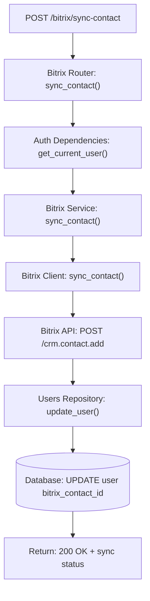

### POST /bitrix/sync-deal
```mermaid
flowchart TD
    A["POST /bitrix/sync-deal"] --> B["Bitrix Router: sync_deal()"]
    B --> C["Auth Dependencies: get_current_user()"]
    C --> D["Bitrix Service: create_deal_from_order()"]
    D --> E["Orders Repository: get_order_by_id()"]
    E --> F[("Database: SELECT order")]
    F --> G["Bitrix Client: create_deal_from_order()"]
    G --> H["Bitrix API: POST /crm.deal.add"]
    H --> I["Orders Repository: update_order()"]
    I --> J[("Database: UPDATE order bitrix_deal_id")]
    J --> K["Return: 200 OK + deal info"]
```

### POST /bitrix/webhook
```mermaid
flowchart TD
    A["POST /bitrix/webhook"] --> B["Bitrix Webhook Router: handle_webhook()"]
    B --> C["Bitrix Service: handle_webhook()"]
    C --> D["Bitrix Service: validate_webhook_signature()"]
    D --> E["Bitrix Service: process_webhook_event()"]
    E --> F[("Database: UPDATE related records")]
    F --> G["Return: 200 OK"]
```

## 8. Call Request Endpoints

### POST /call-requests
```mermaid
flowchart TD
    A["POST /call-requests"] --> B["Call Requests Router: create_call_request()"]
    B --> C["Auth Dependencies: get_current_user()"]
    C --> D["Call Requests Service: create_call_request()"]
    D --> E["Call Requests Repository: create_call_request()"]
    E --> F[("Database: INSERT call_request")]
    F --> G["Return: 200 OK + call request info"]
```

### GET /call-requests
```mermaid
flowchart TD
    A["GET /call-requests"] --> B["Call Requests Router: list_call_requests()"]
    B --> C["Auth Dependencies: get_current_user()"]
    C --> D["Call Requests Service: get_call_requests_by_user()"]
    D --> E["Call Requests Repository: get_call_requests_by_user()"]
    E --> F[("Database: SELECT call_requests")]
    F --> G["Return: 200 OK + call requests list"]
```

## Key External API Integration Points

### Calculator Service Integration
- **Service:** `backend/calculations/service.py`
- **Key Function:** `call_calculator_service()`
- **External Endpoint:** `http://localhost:7000/calculate-price`
- **Purpose:** ML-based manufacturing price calculations
- **File Type Mapping:** STL → "stl", STP → "stp" (fixed in recent updates)

### Bitrix CRM Integration
- **Service:** `backend/bitrix/service.py`
- **Client:** `backend/bitrix/client.py`
- **Sync Service:** `backend/bitrix/sync_service.py`
- **External API:** Bitrix CRM REST API
- **Purpose:** Customer and deal synchronization

## Error Handling Flow

```mermaid
flowchart TD
    A["API Request"] --> B["Router Layer"]
    B --> C["Service Layer"]
    C --> D["Repository Layer"]
    D --> E[("Database")]
    
    B --> F["Validation Error"]
    C --> G["Business Logic Error"]
    D --> H["Database Error"]
    E --> I["SQL Error"]
    
    F --> J["HTTP 422 Unprocessable Entity"]
    G --> K["HTTP 400 Bad Request"]
    H --> L["HTTP 500 Internal Server Error"]
    I --> M["HTTP 500 Internal Server Error"]
    
    J --> N["Error Response to Client"]
    K --> N
    L --> N
    M --> N
```

## Authentication Flow in All Endpoints

```mermaid
flowchart TD
    A["API Request"] --> B["Router Endpoint"]
    B --> C["Auth Dependency: get_current_user()"]
    C --> D["Auth Service: decode_access_token()"]
    D --> E{"Token Valid?"}
    E -->|Yes| F["Extract User Info"]
    E -->|No| G["HTTP 401 Unauthorized"]
    F --> H["Continue to Business Logic"]
    G --> I["Return Error Response"]
    H --> J["Process Request"]
```

This architecture ensures clean separation of concerns, maintainable code, and robust error handling throughout the application.
